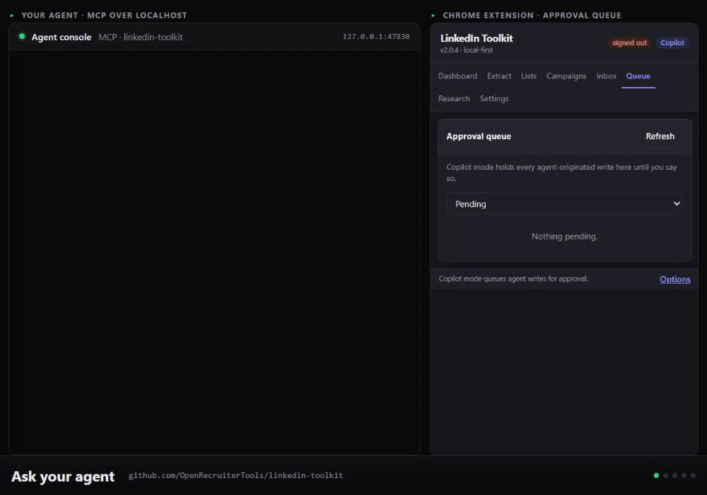

# Open Recruiter Tools

**Free, open-source tools for recruiters that run on your own machine. Candidate data never leaves it.**

## Why this exists

Recruiters handle some of the most sensitive personal data there is: CVs, salaries, home addresses, right-to-work documents, references. And every day, without thinking about it, that data gets pasted into whatever free tool comes up first on Google.

Merge two PDFs? Upload the CV to a website. Redact a name? Upload it. Convert to Word? Upload it. Automate LinkedIn outreach? Hand your account and your prospect list to a cloud service. Most of those services keep the files. Some train on them. Almost none of them are covered by the data agreement you signed with your client or your candidate.

Nobody does this on purpose. It happens because the tools recruiters actually need are small, boring utilities that nobody bothered to build properly, so the only versions that exist are ad-funded upload sites and cloud automation platforms.

We think there should be a place for the other kind: tools that do one recruiting job well, run in your own browser or on your own laptop, and send nothing anywhere. Open source, so you can read exactly what they do. Free, because a PDF merge should not cost money or a candidate's privacy.

That's what this organisation is for.

Website: [openrecruitertools.github.io](https://openrecruitertools.github.io)

LinkedIn Toolkit in demo mode. Every tool call is real; everyone in it is invented. [Try it without installing](https://openrecruitertools.github.io/linkedin-toolkit/try/).

## What's here

| Tool | What it does | What it never sends |
|---|---|---|
| [LinkedIn Toolkit](https://github.com/OpenRecruiterTools/linkedin-toolkit) | Search, research and outreach on LinkedIn from your own logged-in browser, driven by you or by your AI agent, with a human approval queue. An open-source alternative to Waalaxy and PhantomBuster. | Your session, your prospects, your messages. Everything stays in your browser and a local database. |
| [LinkedIn Unfollow](https://github.com/OpenRecruiterTools/linkedin-unfollow) | Unfollow everyone in your feed in one click, connections included, at human pace. | Anything. No account, no server, no analytics. |
| [Recruiter Tools](https://github.com/OpenRecruiterTools/recruiter-tools) | Redact a CV, merge, split, compress, convert and more. Fifteen document tools that run entirely in your browser: [use them here](https://openrecruitertools.github.io/recruiter-tools/). | The file. It is opened and rewritten inside the browser tab, never uploaded. |
| [Google Slides Builder](https://github.com/OpenRecruiterTools/google-slides-builder) | Build Google Slides decks from Python without the API's EMU maths and field masks. | Nothing beyond your own Google account. |

## What's coming

- **More recruiter PDF tools**: cover pages, PDF to images, spreadsheet conversions, and a text-preserving redaction mode.
- **The same tools as a Python package and MCP server**, so your AI agent can use them too.
- **RecruitClaw**, an open-source recruiting assistant you run on your own cloud account, with WhatsApp and desktop automation. Bring your own keys, pay only your own provider.

We'll keep adding tools. The rule for every one of them is the same: it runs locally, it's free, and you can read the code.

## We'd like your help

This is meant to be built with recruiters, not just for them.

- **Tell us what you need.** Which tool do you upload candidate data to today because there's no alternative? Open a discussion or an issue on any repo and describe it. The most-asked-for tool gets built next.
- **Contribute.** Every repo has good-first-issues, tests, and a contributing guide. Recruiters who can't code are just as useful: try a tool, tell us where it confused you.
- **Share it** with a recruiter who's still uploading CVs to random websites.

## Who's behind it

Started by [Dominic Gonsalves](https://www.linkedin.com/in/dominic-g-6a9a5680/), founder of [Formatix AI](https://formatix.ai), a recruitment document platform. Formatix is a commercial product; nothing here depends on it, and nothing here sends data to it.

MIT licensed unless a repo says otherwise.
